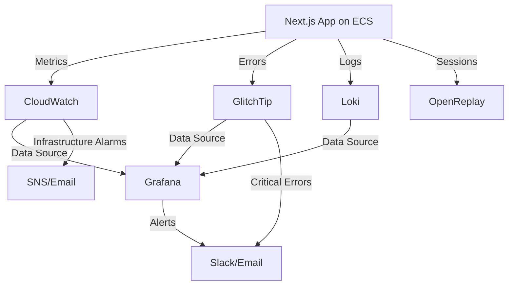

# Open-Source Monitoring to Complement AWS CloudWatch

## Executive Summary

While AWS CloudWatch excels at infrastructure monitoring, it has significant gaps in application-level observability. This document outlines **cost-effective open-source solutions** that fill those gaps while integrating with your existing CloudWatch setup.

**Recommended Open-Source Stack:**
- **GlitchTip** (Error Tracking) - $0-20/month
- **Grafana Loki** (Log Management) - $20-30/month
- **Grafana** (Dashboards) - $10-15/month
- **Total: $30-65/month** (vs. $50-80 for CloudWatch + Sentry hybrid)

---

## CloudWatch Gaps Analysis

### What CloudWatch Does Well ✅
- Infrastructure metrics (ECS, DynamoDB, ALB, S3)
- Native AWS service integration
- Basic log aggregation
- AWS-specific alerting

### What CloudWatch Lacks ❌

| Gap | Impact | Open-Source Solution |
|-----|--------|---------------------|
| **Poor Error Tracking** | No automatic grouping, no stack traces | GlitchTip, SigNoz |
| **Limited Log Search** | Basic queries, expensive retention | Grafana Loki, OpenObserve |
| **No Session Replay** | Can't see user interactions | OpenReplay |
| **Basic Dashboards** | Limited visualization options | Grafana |
| **No User Context** | Errors lack user/session info | GlitchTip + OpenReplay |
| **Expensive Retention** | Long-term logs cost $$$ | Loki (140x cheaper) |

---

## Solution 1: GlitchTip (Error Tracking & APM)

### Overview
**Sentry-compatible** open-source error tracking. Drop-in replacement using Sentry's SDK.

### Cost Analysis

**Self-Hosted on AWS:**
- t3.small EC2 instance: $15/month
- 20GB EBS storage: $2/month
- PostgreSQL RDS (db.t3.micro): $15/month
- **Total: $32/month**

**Hosted (glitchtip.com):**
- Free tier: 1,000 events/month
- Paid: $15/month for 100,000 events
- **Recommended for simplicity**

### Setup Time
- **Hosted**: 1-2 hours (SDK integration only)
- **Self-hosted**: 3-4 hours (Docker + database setup)

### What It Fixes from CloudWatch
✅ **Automatic error grouping** - Similar errors clustered together
✅ **Stack traces with source maps** - See exact line numbers in production code
✅ **User context** - Know which user hit the error
✅ **Performance monitoring** - Track slow API routes and pages
✅ **Release tracking** - Correlate errors with deployments
✅ **Slack/email alerts** - Better than CloudWatch SNS

### Integration with CloudWatch
```javascript
// next.config.js - Both GlitchTip AND CloudWatch metrics
import * as Sentry from '@sentry/nextjs';

// GlitchTip uses Sentry SDK
Sentry.init({
  dsn: 'https://your-glitchtip-instance.com/project-id',
  tracesSampleRate: 0.25, // 25% for cost control
  beforeSend(event) {
    // Also log critical errors to CloudWatch
    if (event.level === 'error') {
      console.error('[CRITICAL]', event);
    }
    return event;
  }
});
```

### Next.js Integration
```bash
# Install Sentry SDK (works with GlitchTip!)
npx @sentry/wizard@latest -i nextjs

# Update .env to point to GlitchTip
NEXT_PUBLIC_SENTRY_DSN=https://your-glitchtip.com/...
```

### Pros
- ✅ Sentry-compatible (easy migration)
- ✅ Very affordable ($15/month hosted or $32/month self-hosted)
- ✅ Simple setup (2-4 hours)
- ✅ Full error context and stack traces
- ✅ Performance monitoring included

### Cons
- ❌ Less polished UI than Sentry
- ❌ Fewer integrations than commercial tools
- ❌ Self-hosted requires maintenance

---

## Solution 2: Grafana Loki (Log Management)

### Overview
**Prometheus-inspired log aggregation** with minimal indexing = massive cost savings.

### Cost Analysis

**Self-Hosted on AWS:**
- t3.medium EC2 (Loki): $30/month
- 100GB EBS storage: $10/month
- S3 for long-term retention: $2-5/month
- **Total: $42-45/month**

**Comparison:**
- CloudWatch Logs (8GB/month, 30-day retention): $25/month
- Loki (8GB/month, 90-day retention): $42/month
- **Loki wins for retention >30 days**

### Setup Time
- **Basic setup**: 4-6 hours
- **Production setup**: 12-20 hours (HA, scaling)

### What It Fixes from CloudWatch
✅ **Superior querying** - LogQL is far more powerful than CloudWatch Insights
✅ **Cost-effective retention** - 90+ days without breaking the bank
✅ **Label-based indexing** - Query by metadata, not full-text search
✅ **Grafana integration** - Beautiful log visualization
✅ **Stream logs in real-time** - Better than CloudWatch console

### Architecture
```
┌─────────────────────────────────────────────────┐
│         Next.js on ECS Fargate                  │
│  (Logs to stdout/stderr)                        │
└────────────────┬────────────────────────────────┘
                 │
        ┌────────┴────────┐
        │                 │
        ▼                 ▼
┌──────────────┐  ┌──────────────┐
│  CloudWatch  │  │   Promtail   │
│    Logs      │  │   (Agent)    │
└──────────────┘  └───────┬──────┘
                          │
                          ▼
                  ┌──────────────┐
                  │ Grafana Loki │
                  │  (Storage)   │
                  └───────┬──────┘
                          │
                          ▼
                  ┌──────────────┐
                  │   Grafana    │
                  │ (Dashboards) │
                  └──────────────┘
```

### Integration Strategy

**Option A: Dual Logging (Recommended)**
- Keep CloudWatch Logs for AWS integration
- Forward critical logs to Loki for advanced queries
- Use Promtail to read CloudWatch Log Streams

**Option B: Direct to Loki**
- Configure ECS to log directly to Loki
- Lower costs (no CloudWatch ingestion fees)
- Lose native AWS integrations

### LogQL Examples
```logql
# Find all errors in the last hour from auth service
{service="auth"} |= "error" | json | level="error"

# Calculate error rate per minute
sum(rate({app="spot-buddy"} |= "error" [1m])) by (service)

# Find slow API requests (>1s)
{job="api"} | json | duration > 1000

# Pattern matching for OCR quota errors
{app="spot-buddy"} |~ "OCR quota (exceeded|remaining)"
```

### Pros
- ✅ Dramatically cheaper long-term storage
- ✅ Powerful LogQL query language
- ✅ Seamless Grafana integration
- ✅ Labels prevent index bloat

### Cons
- ❌ More complex setup than CloudWatch
- ❌ Requires maintenance and monitoring
- ❌ No full-text indexing (by design)

---

## Solution 3: Grafana (Dashboards & Visualization)

### Overview
**Industry-standard dashboarding** with CloudWatch integration built-in.

### Cost Analysis

**Self-Hosted:**
- t3.small EC2: $15/month
- 20GB EBS: $2/month
- **Total: $17/month**

**Grafana Cloud:**
- Free tier: 10k series, 50GB logs, 3 users
- Pro: $49/month (50k series, 100GB logs)
- **Free tier likely sufficient**

### Setup Time
- **Basic**: 2-4 hours (install + CloudWatch connection)
- **Production**: 15-25 hours (dashboards, alerting, auth)

### What It Fixes from CloudWatch
✅ **Beautiful dashboards** - Professional, customizable visualizations
✅ **Multi-source queries** - Combine CloudWatch + Loki + Prometheus
✅ **Advanced alerting** - Better than CloudWatch Alarms
✅ **Template variables** - Dynamic dashboards (filter by region, service, etc.)
✅ **Dashboard sharing** - Export/import as JSON

### CloudWatch Integration
```yaml
# datasources.yml
apiVersion: 1
datasources:
  - name: CloudWatch
    type: cloudwatch
    jsonData:
      authType: keys
      defaultRegion: us-east-1
    secureJsonData:
      accessKey: ${AWS_ACCESS_KEY_ID}
      secretKey: ${AWS_SECRET_ACCESS_KEY}
```

### Example Dashboard Query
```sql
-- Grafana panel querying CloudWatch
-- ECS CPU utilization
SELECT AVG(CPUUtilization)
FROM AWS/ECS
WHERE ServiceName = 'spot-buddy-service'
GROUP BY TIME(5m)
```

### Pros
- ✅ Industry standard (huge community)
- ✅ Native CloudWatch data source
- ✅ Free tier is generous
- ✅ Plugin ecosystem

### Cons
- ❌ Steep learning curve for advanced features
- ❌ Can become resource-heavy at scale

---

## Solution 4: SigNoz (Comprehensive APM)

### Overview
**OpenTelemetry-native** full-stack observability (metrics, traces, logs).

### Cost Analysis

**SigNoz Cloud:**
- $49/month (includes logs, traces, metrics)
- Unlimited team members
- **Best for low-ops teams**

**Self-Hosted:**
- t3.large EC2 (ClickHouse + SigNoz): $60/month
- 200GB EBS: $20/month
- **Total: $80/month**

### Setup Time
- **Cloud**: 2-3 hours (instrumentation only)
- **Self-hosted**: 8-12 hours (Docker Compose setup)

### What It Fixes from CloudWatch
✅ **Distributed tracing** - See request flow across services
✅ **APM built-in** - Database queries, API latency, etc.
✅ **Unified observability** - Logs, metrics, traces in one UI
✅ **Better error tracking** - Stack traces with user context
✅ **Service dependency maps** - Visualize architecture

### Next.js Integration
```typescript
// instrumentation.ts (Next.js 15 instrumentation hook)
import { registerOTel } from '@vercel/otel';

export function register() {
  registerOTel({
    serviceName: 'spot-buddy',
    traceExporter: 'otlp',
    endpoint: 'https://ingest.signoz.io:443/v1/traces',
  });
}
```

### Pros
- ✅ All-in-one solution (replaces multiple tools)
- ✅ OpenTelemetry standard (vendor neutral)
- ✅ Excellent Next.js support
- ✅ Cloud option = zero ops

### Cons
- ❌ More expensive than GlitchTip alone
- ❌ Self-hosted requires ClickHouse expertise
- ❌ Overkill if you only need error tracking

---

## Solution 5: OpenObserve (Ultra-Efficient Logs)

### Overview
**140x cheaper storage** than Elasticsearch for logs. Columnar storage (Parquet).

### Cost Analysis

**Self-Hosted:**
- t3.medium EC2: $30/month
- 50GB S3 (compressed): $1/month
- **Total: $31/month for 100GB+ logs**

**Comparison:**
- Elasticsearch (100GB logs): ~$150/month
- CloudWatch (100GB logs): ~$60/month
- OpenObserve (100GB logs): ~$31/month

### Setup Time
- **Basic**: 6-8 hours
- **Production**: 12-16 hours

### What It Fixes from CloudWatch
✅ **Dramatic cost savings** for high log volumes
✅ **SQL queries** - Standard SQL, not proprietary query language
✅ **Real-time ingestion** - Sub-second query latency
✅ **S3 storage backend** - Leverage cheap object storage
✅ **Automatic parsing** - JSON, CSV, syslog, etc.

### When to Use
- **High log volume** (>50GB/month)
- **Long retention** (6+ months)
- **Complex queries** (SQL-based analysis)

### Pros
- ✅ Incredible storage efficiency
- ✅ SQL query interface (familiar)
- ✅ S3 backend = cheap retention

### Cons
- ❌ Newer project (less mature than Loki)
- ❌ Smaller community
- ❌ Requires more manual configuration

---

## Solution 6: OpenReplay (Session Replay)

### Overview
**Open-source LogRocket alternative**. See user interactions as video-like replays.

### Cost Analysis

**Self-Hosted:**
- t3.large EC2: $60/month
- 100GB S3 (recordings): $2/month
- **Total: $62/month**

**Cloud (openreplay.com):**
- Pay-as-you-go (no per-seat charges)
- ~$75-150/month for 10k sessions
- **Similar to self-hosted costs**

### Setup Time
- **Cloud**: 1-2 hours
- **Self-hosted**: 8-12 hours

### What It Fixes from CloudWatch
✅ **Session replay** - See exactly what user did before error
✅ **User flow analysis** - Understand UX issues
✅ **Frontend performance** - Track real user metrics (RUM)
✅ **Rage clicks** - Detect user frustration

### Next.js Integration
```typescript
// app/layout.tsx
import Tracker from '@openreplay/tracker';

const tracker = new Tracker({
  projectKey: process.env.NEXT_PUBLIC_OPENREPLAY_KEY!,
  ingestPoint: 'https://openreplay.myapp.com/ingest',
});

tracker.start();
```

### When to Use
- **UX debugging** - Can't reproduce user issues
- **Conversion optimization** - See where users drop off
- **Support enhancement** - Co-browse with users

### Pros
- ✅ Only open-source session replay tool
- ✅ Privacy controls (mask sensitive data)
- ✅ Error correlation

### Cons
- ❌ Expensive for high-traffic apps
- ❌ Privacy concerns for health/fitness data
- ❌ Large storage requirements

---

## Recommended Combinations

### Budget Stack ($30-65/month)
**For: Early-stage apps, tight budgets**

```
CloudWatch (Infrastructure) ──┐
                              │
GlitchTip (Errors)      ──────┼──> Grafana (Dashboards)
                              │
Loki (Logs)             ──────┘

Monthly Cost: $30-65
Setup Time: 15-20 hours
Maintenance: 3-5 hours/month
```

**What You Get:**
- ✅ Infrastructure monitoring (CloudWatch)
- ✅ Error tracking with stack traces (GlitchTip)
- ✅ Advanced log queries (Loki)
- ✅ Beautiful dashboards (Grafana)

**What's Missing:**
- ❌ Session replay
- ❌ Advanced APM/distributed tracing

---

### Balanced Stack ($80-120/month)
**For: Growing apps, need more insights**

```
CloudWatch (Infrastructure) ──┐
                              │
SigNoz (APM + Errors)   ──────┼──> SigNoz UI (All-in-one)
                              │
Loki (Log Retention)    ──────┘

Monthly Cost: $80-120
Setup Time: 20-30 hours
Maintenance: 4-6 hours/month
```

**What You Get:**
- ✅ Everything from Budget Stack
- ✅ Distributed tracing
- ✅ Service dependency maps
- ✅ Advanced performance monitoring

**What's Missing:**
- ❌ Session replay (can add OpenReplay for +$60)

---

### Premium Stack ($150-250/month)
**For: Production apps, comprehensive observability**

```
CloudWatch (Infrastructure) ──┐
                              │
SigNoz Cloud (APM)      ──────┼──> Grafana (Unified Dashboards)
                              │
Loki (Logs)             ──────┤
                              │
OpenReplay (Sessions)   ──────┘

Monthly Cost: $150-250
Setup Time: 35-50 hours
Maintenance: 5-8 hours/month
```

**What You Get:**
- ✅ Complete observability stack
- ✅ Session replay for UX debugging
- ✅ Infrastructure + Application + User monitoring
- ✅ Long-term log retention

---

## Integration Architecture

### How They Work Together



### Data Flow Example: User Error Scenario

1. **User encounters error** in Next.js app
2. **GlitchTip captures**: Stack trace, user context, request data
3. **OpenReplay records**: User actions leading up to error (if enabled)
4. **CloudWatch logs**: Infrastructure metrics at time of error
5. **Loki stores**: Application logs for historical analysis
6. **Grafana correlates**: Shows all data sources in one dashboard

---

## Implementation Roadmap

### Phase 1: Error Tracking (Week 1)
**Goal:** Stop losing errors in CloudWatch log noise

- [ ] Set up GlitchTip (hosted or self-hosted)
- [ ] Integrate Sentry SDK in Next.js app
- [ ] Configure source maps for production
- [ ] Set up Slack alerts for critical errors
- [ ] Test error capture and stack traces

**Time:** 4-6 hours
**Cost:** $0-32/month

---

### Phase 2: Enhanced Dashboards (Week 2)
**Goal:** Better visualization than CloudWatch console

- [ ] Deploy Grafana (EC2 or Cloud free tier)
- [ ] Connect CloudWatch as data source
- [ ] Create infrastructure dashboard (ECS, DynamoDB, ALB)
- [ ] Add GlitchTip data source
- [ ] Create error tracking dashboard

**Time:** 6-10 hours
**Cost:** +$0-17/month

---

### Phase 3: Advanced Logging (Week 3-4)
**Goal:** Cost-effective log retention and queries

- [ ] Deploy Loki infrastructure
- [ ] Configure Promtail to forward logs
- [ ] Set up log retention policies
- [ ] Create log query dashboard in Grafana
- [ ] Test LogQL queries for common scenarios

**Time:** 12-20 hours
**Cost:** +$20-45/month

---

### Phase 4: Optional Enhancements (Month 2+)
**Choose based on needs:**

**Option A: APM Upgrade**
- Migrate from GlitchTip to SigNoz Cloud
- Get distributed tracing + better APM
- **+$17/month** (from $32 GlitchTip → $49 SigNoz)

**Option B: Session Replay**
- Add OpenReplay for UX debugging
- **+$60-150/month**

**Option C: Keep It Simple**
- Optimize existing stack
- Focus on using tools effectively
- **$0 additional**

---

## Cost Comparison Summary

| Stack | Monthly Cost | Setup Time | Maintenance | Best For |
|-------|-------------|------------|-------------|----------|
| **CloudWatch Only** | $25-60 | 4-6h | 1-2h/mo | AWS-only monitoring |
| **CloudWatch + Sentry** | $50-80 | 8-10h | 1-2h/mo | Balanced (our original rec) |
| **Budget Open-Source** | $30-65 | 15-20h | 3-5h/mo | Tight budgets, DIY mindset |
| **Balanced Open-Source** | $80-120 | 20-30h | 4-6h/mo | Growing apps |
| **Premium Open-Source** | $150-250 | 35-50h | 5-8h/mo | Comprehensive observability |
| **Full SaaS (Datadog, etc.)** | $300-800 | 16-24h | 1-2h/mo | Enterprise, low-ops |

---

## Decision Framework

### Choose CloudWatch + Sentry (Our Original Recommendation) If:
- ✅ You value simplicity over cost savings ($20/month difference)
- ✅ You have <5 hours/month for monitoring maintenance
- ✅ You want production-ready tools immediately
- ✅ You're willing to pay for peace of mind

### Choose Open-Source Stack If:
- ✅ You have 3-8 hours/month for maintenance
- ✅ You want to save $20-50/month
- ✅ You enjoy learning and tinkering
- ✅ You need specific features (e.g., session replay, advanced logs)
- ✅ You want vendor independence

### Start Here for Most Teams:

**Phase 1: Minimum Viable Monitoring**
```
CloudWatch (existing) + GlitchTip (hosted $15/mo) + Grafana Cloud (free)
Total: $15/month + 8 hours setup
```

**Phase 2: Add Advanced Logging (if needed)**
```
+ Loki self-hosted
Total: $45-65/month + 20 hours setup
```

**Phase 3: Upgrade to Full APM (if needed)**
```
Replace GlitchTip with SigNoz Cloud
Total: $80-120/month
```

---

## Quick Start: GlitchTip + Grafana

### 1. GlitchTip Setup (2 hours)

```bash
# Sign up at glitchtip.com (free tier)
# Or self-host:
docker run -d \
  --name glitchtip \
  -e DATABASE_URL=postgres://... \
  -e SECRET_KEY=... \
  -p 8080:8080 \
  glitchtip/glitchtip:latest
```

### 2. Next.js Integration (1 hour)

```bash
npm install @sentry/nextjs
npx @sentry/wizard@latest -i nextjs
```

```javascript
// sentry.client.config.ts
import * as Sentry from '@sentry/nextjs';

Sentry.init({
  dsn: process.env.NEXT_PUBLIC_GLITCHTIP_DSN,
  tracesSampleRate: 0.25,
  environment: process.env.NODE_ENV,
});
```

### 3. Grafana Cloud Setup (2 hours)

```bash
# Sign up at grafana.com (free tier)
# Add CloudWatch data source in UI
# Import dashboard from grafana.com/dashboards
```

### 4. First Dashboard (2 hours)

```sql
-- Create panel in Grafana
-- Query: ECS CPU from CloudWatch
SELECT AVG(CPUUtilization)
FROM AWS/ECS
WHERE ServiceName = 'spot-buddy-service'

-- Add GlitchTip error count
-- Query: Error count by hour
```

**Total Time: 7-8 hours**
**Total Cost: $15/month**

---

## Conclusion

**Our Updated Recommendation:**

For Spot Buddy's current stage, we recommend **starting with the Budget Open-Source Stack** if you're comfortable with 15-20 hours of initial setup:

```
GlitchTip (hosted) + Grafana Cloud (free) + CloudWatch (existing)
= $15/month vs. $50-80 for CloudWatch + Sentry
```

**Why:**
1. **Save $35-65/month** while building ($420-780/year)
2. **Learn valuable DevOps skills** (Grafana, log management)
3. **Vendor independence** (can migrate to any compatible tool)
4. **Upgrade path** (add Loki, SigNoz, OpenReplay later)

**However, stick with CloudWatch + Sentry if:**
- You're **launching in <2 weeks** (no time for setup)
- You're **non-technical founder** (Sentry's UI is more polished)
- Your **time is worth >$50/hour** (break-even at 1 hour saved/month)

Both approaches are valid. The open-source route saves money but requires ongoing maintenance. The SaaS route (Sentry) saves time but costs more.

---

**Next Steps:**
1. Review this document with your team
2. Decide on Budget vs. Balanced vs. Premium stack
3. Start with Phase 1 (Error Tracking) this week
4. Evaluate after 30 days and adjust

**Questions to Consider:**
- How much is your time worth per hour?
- Do you enjoy infrastructure work?
- What's your monthly monitoring budget?
- How critical is uptime monitoring?

Let me know which direction you want to go and I can help implement it! 🚀
